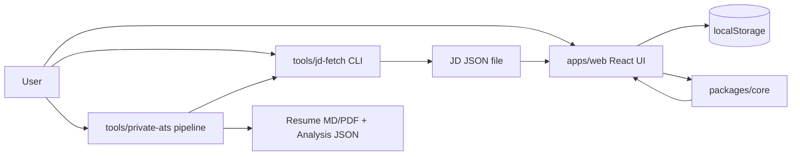

# Resume Vault System Design Review (English)

## 1. Scope and Goals

This review covers the current architecture in this repository:
- Frontend app (`apps/web`) for local-first resume editing and generation
- Core matching/generation engine (`packages/core`)
- JD fetch utility (`tools/jd-fetch`) for local browser automation
- Private ATS pipeline (`tools/private-ats`) for local submission-ready outputs

Primary product constraints:
- Must run as a static site on GitHub Pages
- Must keep user data local by default
- Must support bilingual workflow (`zh-TW`, `en-AU`)
- Must keep matching deterministic and explainable

## 2. High-Level Architecture

## 3. Module Responsibilities

### `apps/web`
- Owns UX state, i18n labels, and local persistence.
- Enforces locale-specific JD source guardrails (`104` for `zh-TW`, `LinkedIn/Seek` for `en-AU`).
- Imports custom resume text into reusable entries.
- Calls `generateResume(...)` from `packages/core`.
- Exports Markdown, Obsidian Markdown, and DB JSON.

### `packages/core`
- Defines shared domain types (`ResumeEntry`, `ResumeTemplate`, `JobDescription`, `GeneratedResume`).
- Implements deterministic token-based scoring (`scoreEntries`).
- Selects entries by template constraints (`selectEntriesForTemplate`).
- Builds fit/gap decision metadata (`buildMatchReport`) and final markdown body.

### `tools/jd-fetch`
- Uses Playwright to fetch JD text from supported domains.
- Uses adapter pattern per site (`104`, `LinkedIn`, `Seek`) plus generic fallback.
- Applies network safety checks (private network and localhost blocked by default).

### `tools/private-ats`
- Takes private input files (profile, contact, job URL list).
- Normalizes Seek URL formats, fetches JD JSON, ranks profile entries, generates tailored MD/PDF.
- Emits per-job analysis JSON and run summary.

## 4. Core Data Flow

1. User builds entry bank and templates in `apps/web`.
2. User adds JD by paste or JSON import (optionally produced by `jd-fetch`).
3. `generateResume` in `packages/core`:
   - tokenizes JD and entries
   - computes trace scores
   - selects entries per template section caps and tag preferences
   - returns `outputMd`, `trace`, and `matchReport`
4. UI exports generated results.

Private ATS lane:
1. Read URL list/profile/contact from local files.
2. Fetch each JD with `jd-fetch`.
3. Rank parsed profile entries against JD text.
4. Write MD/PDF + analysis JSON + run summary.

## 5. Data Structure Decisions and Tradeoffs

## 5.1 `StoredState` as object of arrays (`entries`, `templates`, `jobs`)
Current:
- `StoredState = { entries: ResumeEntry[], templates: ResumeTemplate[], jobs: JobDescription[] }`

Why chosen:
- Simple JSON serialization to `localStorage`.
- Easy import/export and migration (`normalizeState`, starter ensure).
- Works well for current single-user, browser-local usage.

Tradeoff:
- Lookup is O(n) by ID unless indexed in memory.
- Large datasets can make filtering and updates less efficient.

Alternatives:
- Normalized shape: `{ entriesById: Record<string, Entry>, entryIds: string[] }`
- IndexedDB with object stores and indexed queries.
- Client-side embedded DB (Dexie/SQLite WASM) for larger scale.

## 5.2 `Map`/`Set` for in-memory matching and dedup
Current usage:
- `Map` for grouping and fast lookup (`entryMap`, category grouping, starter map, host cache).
- `Set` for token overlap, used IDs, stop words, meta tokens.

Why chosen:
- Near O(1) membership checks.
- Clear intent for uniqueness and fast filtering.

Tradeoff:
- Slight memory overhead vs plain arrays.
- Not directly JSON-serializable (used only transiently in compute paths).

Alternatives:
- Plain arrays + linear scan (simpler but slower for frequent membership checks).
- Object dictionaries (`Record<string, true>`) for serializable membership sets.

## 5.3 Token arrays + deterministic sort for scoring
Current:
- `tokenize(...)` returns `string[]`.
- Frequency sort + bounded token windows (`MAX_SIGNAL_TOKENS`).
- Deterministic tie-break by lexical `entryId`.

Why chosen:
- Explainable and reproducible ranking.
- No model dependency, no remote API, no randomness.
- Works for both English and Chinese heuristics.

Tradeoff:
- Heuristic quality ceiling lower than embedding/LLM semantic matching.
- Domain vocabulary drift can reduce precision/recall.

Alternatives:
- BM25/inverted index.
- Embedding similarity (local model or API).
- Hybrid lexical + embedding rerank.

## 5.4 Adapter registry as ordered array
Current:
- `const adapters: JobAdapter[] = [adapter104, linkedinAdapter, seekAdapter]`
- `find(...)` first supporting adapter.

Why chosen:
- Minimal, explicit, easy to extend.

Tradeoff:
- Priority depends on array order.
- No dynamic plugin loading metadata.

Alternatives:
- Map keyed by hostname pattern.
- Plugin registry with explicit priority weights.

## 5.5 Host safety cache as `Map<string, boolean>`
Current:
- DNS resolution result cached in process memory.

Why chosen:
- Reduces repeated DNS lookups.
- Keeps safety checks fast after first resolution.

Tradeoff:
- No TTL/eviction; long-running process could use stale entries.

Alternatives:
- LRU cache with TTL.
- Re-resolve after fixed interval.

## 5.6 Markdown output as plain string assembly
Current:
- Resume body rendered via string sections (`renderSection`) and joins.

Why chosen:
- Zero dependency and deterministic output.
- Easy snapshot/regression testing.

Tradeoff:
- Limited formatting flexibility and composition reuse.

Alternatives:
- AST-based markdown builder.
- Template engine (Mustache/Handlebars) with versioned templates.

## 6. Key Architectural Tradeoffs

1. Static deployability vs runtime automation
- Tradeoff: GitHub Pages cannot run Playwright server-side.
- Decision: keep JD fetch as local CLI tool and import JSON into UI.

2. Privacy-first local storage vs cross-device sync
- Tradeoff: no automatic cloud sync.
- Decision: localStorage + explicit DB export/import.

3. Deterministic heuristic matching vs semantic intelligence
- Tradeoff: predictable traces but weaker deep semantic inference.
- Decision: deterministic lexical matching plus fit/gap report.

4. Minimal dependencies vs feature depth
- Tradeoff: lean stack and maintainability, but fewer advanced capabilities.
- Decision: no backend and no new heavy ranking dependencies.

## 7. Why This Architecture Fits the Product Stage

- Fast iteration for a solo/local workflow.
- Explainable output needed for resume editing trust.
- Easy deployment and cost profile (GitHub Pages + local tooling).
- Good separation: UI concerns vs matching engine vs scraping utility.

## 8. Deep-Dive Questions (with answer direction)

1. Why not use a backend database now?
- Current requirement is local-first privacy and static hosting; backend adds ops/security burden early.

2. Why arrays in state instead of normalized entities?
- Simpler import/export and migration; acceptable scale currently.

3. How is deterministic ranking guaranteed?
- No randomness; fixed scoring formula; lexical tie-break by `entryId`.

4. How do you explain match quality to users?
- `trace` reasons + `matchReport` (`coverageScore`, `decision`, `gaps`, `strengths`).

5. Why Set-based token overlap and not cosine similarity?
- Lower complexity, no vector infra, deterministic and debuggable.

6. What prevents malformed JSON import attacks?
- `parseJsonSafely` reviver blocks `__proto__`, `constructor`, `prototype`.

7. Why domain allowlist in UI?
- Prevent cross-locale source mismatch and reduce bad-input noise.

8. How do you control SSRF risk in JD fetch?
- Block localhost/private network by default; explicit override flag required.

9. Why fallback generic extraction after adapter miss?
- Increases robustness for unknown layouts while still returning warnings.

10. How would you scale to 100k entries?
- Move to IndexedDB, add indexes, precomputed token index, and batched ranking.

11. Why not parse resume import with full markdown AST?
- Current heuristic parser is lightweight and fast; AST parser can be phase 2 for higher fidelity.

12. How do you migrate starter templates safely?
- ID migration map + ensure pass that enforces canonical starter definitions.

13. What are the failure modes in live JD capture?
- Bot wall, login wall, changed DOM selectors, network safety false positives.

14. How is localization handled?
- UI text via locale dictionary; data has locale field for entries/templates filtering.

15. How to improve matching without UX bloat?
- Upgrade scoring weights/signals and fit-gap logic in core, keep UI stable.

16. Why keep analysis JSON in private pipeline?
- Auditability and reproducibility for each generated resume.

17. Could recency bias overfit recently edited entries?
- Bounded boost (small fixed points) to prevent domination.

18. What is the rollback strategy for bad ranking changes?
- Core unit tests + fixture regressions + deterministic output snapshots.

19. Why no asynchronous job queue in frontend?
- Current user flow is single interactive session; complexity not justified yet.

20. What is the next architecture milestone?
- Optional IndexedDB storage + optional semantic rerank layer while preserving deterministic base trace.

## 9. Practical Improvement Backlog (Core Logic Focus)

- Add token normalization dictionary (e.g., auth/authentication/OpenID) for better recall.
- Add section-aware score penalties (avoid overfilling from one category).
- Add optional per-template weighting profile.
- Add adapter selector health checks and fixture update workflow.
- Add TTL to DNS host cache in `jd-fetch`.

