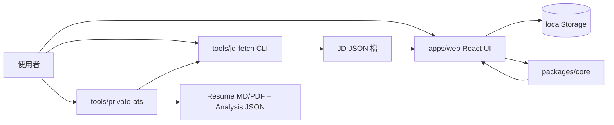

# Resume Vault 系統設計審查（繁體中文）

## 1. 範圍與目標

本文件審查目前專案架構：
- 前端網站（`apps/web`）：本機優先的履歷資料庫與生成介面
- 核心引擎（`packages/core`）：匹配、排序、輸出
- JD 擷取工具（`tools/jd-fetch`）：本機 Playwright 抓職位描述
- 私有 ATS 流程（`tools/private-ats`）：本機產出可投遞檔案

產品限制條件：
- 必須可部署於 GitHub Pages（靜態站）
- 預設資料留在本機
- 支援雙語（`zh-TW` / `en-AU`）
- 匹配要可解釋、可重現

## 2. 高階架構

## 3. 模組職責

### `apps/web`
- 負責使用者流程、i18n 文案、狀態保存。
- 套用語系來源限制（`zh-TW` 只允許 104；`en-AU` 允許 LinkedIn/Seek）。
- 匯入自訂履歷文字並轉成 entries。
- 呼叫 `packages/core` 的 `generateResume(...)`。
- 匯出 Markdown、Obsidian Markdown、DB JSON。

### `packages/core`
- 提供共用領域型別（`ResumeEntry`、`ResumeTemplate`、`JobDescription`、`GeneratedResume`）。
- 執行可重現的 token-based 計分（`scoreEntries`）。
- 依模板規則選詞條（`selectEntriesForTemplate`）。
- 產生 fit/gap 決策（`buildMatchReport`）與履歷 Markdown。

### `tools/jd-fetch`
- 用 Playwright 擷取職位描述。
- 透過 adapter pattern 支援 104 / LinkedIn / Seek，並保留 generic fallback。
- 預設封鎖 localhost / private network（安全預設）。

### `tools/private-ats`
- 讀取本機私有輸入（profile/contact/job url list）。
- 正規化 Seek URL、抓 JD、排序詞條、輸出 MD/PDF。
- 產生每個職缺的 analysis JSON 與整體 summary JSON。

## 4. 主要資料流程

主站流程：
1. 使用者建立 entries 與 templates。
2. 輸入 JD（貼上或匯入 JSON）。
3. `generateResume`：
   - 斷詞與訊號萃取
   - 分數計算與 trace
   - 依模板 section 上限/標籤偏好挑詞條
   - 回傳 `outputMd`、`trace`、`matchReport`
4. 匯出結果。

Private ATS 流程：
1. 讀私有輸入檔。
2. 透過 `jd-fetch` 擷取 JD JSON。
3. 對 profile entries 做排序與挑選。
4. 輸出 `resume.md/pdf`、`analysis.json`、`run-summary.json`。

## 5. 資料結構選型：為何這樣做、替代方案是什麼

## 5.1 `StoredState` 採「物件 + 陣列」
現況：
- `StoredState = { entries: ResumeEntry[], templates: ResumeTemplate[], jobs: JobDescription[] }`

為何採用：
- 直接 JSON 序列化到 `localStorage`。
- 匯入/匯出與版本升級流程簡單（`normalizeState`、starter ensure）。
- 符合目前單使用者、本機使用規模。

取捨：
- 依 ID 查找是 O(n)（除非額外建索引）。
- 資料量上升時，過濾與更新效率會下降。

替代方案：
- 正規化結構：`byId + ids`
- IndexedDB（含 index 查詢）
- 客戶端嵌入式 DB（Dexie / SQLite WASM）

## 5.2 `Map` / `Set` 做計算期索引與去重
現況用途：
- `Map`：entry 快取、分類分組、starter map、host cache。
- `Set`：token overlap、used ids、stop words、meta tokens。

為何採用：
- 成員查找接近 O(1)。
- 語意清晰（唯一性、查重）。

取捨：
- 相較純陣列有額外記憶體開銷。
- 無法直接 JSON 序列化（但目前只在計算流程內使用）。

替代方案：
- 純陣列 + 線性掃描（簡單但效能較差）
- `Record<string, boolean>`（可序列化，但語意較弱）

## 5.3 token 陣列 + 決定性排序
現況：
- `tokenize(...) -> string[]`
- 頻率排序 + token 數量上限
- 同分以 `entryId` 字典序打破平手

為何採用：
- 結果可重現、可解釋。
- 無需模型服務或外部 API。
- 中英混合場景可用。

取捨：
- 相比 embedding/LLM 語意匹配，上限較低。
- 專有名詞漂移時精準度可能下降。

替代方案：
- BM25 / 倒排索引
- embedding 相似度（本地或雲端）
- lexical + embedding rerank 混合模式

## 5.4 Adapter registry 採陣列順序匹配
現況：
- `const adapters = [adapter104, linkedinAdapter, seekAdapter]`
- `find(...)` 第一個命中的 adapter

為何採用：
- 結構最小、可讀性高、擴充快。

取捨：
- 命中優先順序依陣列順序。
- 沒有 plugin metadata 與動態載入管理。

替代方案：
- 依 hostname pattern 的 Map
- 帶 priority 權重的插件註冊系統

## 5.5 DNS 安全快取採 `Map<string, boolean>`
現況：
- `jd-fetch` 對 hostname 私網判斷結果做程序內快取。

為何採用：
- 降低重複 DNS 查詢。
- 提升連續抓取效能。

取捨：
- 無 TTL / eviction，長時程序可能快取過舊。

替代方案：
- LRU + TTL
- 固定時間重新解析

## 5.6 Markdown 輸出採字串組裝
現況：
- 用 `renderSection` + string join 產出履歷。

為何採用：
- 零額外依賴、可重現、容易做 regression test。

取捨：
- 複雜版型彈性有限。

替代方案：
- Markdown AST builder
- 模板引擎（Mustache/Handlebars）+ 版本化模板

## 6. 關鍵架構 Tradeoff

1. 可部署性 vs 站內自動化抓取
- GitHub Pages 不能在站上跑 Playwright。
- 決策：抓取放本機 CLI，主站做 JSON 匯入。

2. 隱私優先 vs 跨裝置同步
- 沒有雲端自動同步。
- 決策：localStorage + 明確匯出/匯入。

3. 可解釋規則 vs 語意智能上限
- 規則式可解釋、可重現，但語意泛化較弱。
- 決策：先做 deterministic matching + fit/gap。

4. 低依賴維運 vs 進階能力
- 架構輕量、維護成本低，但功能深度有限。
- 決策：不引入 backend 與重型排名依賴。

## 7. 為何這個架構適合現在階段

- 快速迭代：UI 與核心邏輯分離清楚。
- 成本可控：GitHub Pages + 本機工具。
- 信任可見：trace + match report 讓結果可審查。
- 易擴充：adapter 可加、模板可加、核心分數可調。

## 8. Deep-Dive 問題清單（含回答方向）

1. 為什麼現在不做後端？
- 需求是本機優先 + 靜態部署；後端會提高維運與資安成本。

2. 為什麼 state 用陣列，不先正規化？
- 匯入匯出與遷移最簡；目前資料規模可接受。

3. 排名如何保證可重現？
- 固定 scoring、無隨機、同分用 `entryId` 字典序。

4. 使用者如何知道匹配是否合理？
- `trace` 理由 + `matchReport`（coverage / gaps / decision）。

5. 為什麼不用向量相似度？
- 降低複雜度與外部依賴，先追求可解釋與穩定。

6. 如何避免 JSON 匯入被污染？
- `parseJsonSafely` 阻擋 `__proto__` / `constructor` / `prototype`。

7. 為什麼要做 domain allowlist？
- 降低語系來源不匹配與無效輸入噪音。

8. `jd-fetch` 如何避免 SSRF 風險？
- 預設阻擋私網/localhost，只能顯式 override。

9. 為什麼 adapter miss 還要 generic fallback？
- 增加韌性，未知頁面仍可輸出並附 warnings。

10. 若詞條 10 萬筆怎麼擴充？
- 換 IndexedDB + index + 預先建 token index + 批次 ranking。

11. 為什麼匯入履歷先用 heuristic parser？
- 實作輕、速度快，先滿足常見 markdown/text。

12. Starter template 遷移怎麼保證一致？
- 使用 ID migration + ensure 注入 canonical starter。

13. 線上抓 JD 主要失敗模式有哪些？
- Bot wall、登入牆、DOM selector 改版、私網誤判。

14. i18n 做法與邊界？
- 文案字典 + entry/template locale 過濾，尚未做自動翻譯。

15. 如何提升匹配品質但不增加 UI 複雜度？
- 優先升級 core scoring 與 fit/gap，不先加新操作面板。

16. 為什麼 private ATS 要輸出 analysis JSON？
- 可稽核、可追蹤、可做回歸比較。

17. recency boost 會不會偏誤太大？
- 目前是 bounded 小分數，避免壓過內容相關性。

18. 排名更新後如何回滾？
- core 單元測試 + fixture regression + deterministic output 比對。

19. 前端為何不做非同步任務佇列？
- 現在是單人互動流程，先不增加複雜度。

20. 下一個架構里程碑是什麼？
- 可選 IndexedDB + 可選語意 rerank，同時保留 deterministic base trace。

## 9. 建議的下一步（聚焦核心邏輯）

- 增加同義詞/詞彙正規化表（如 auth/authentication/OpenID）。
- 增加 section-aware 懲罰，避免某分類過度佔比。
- 支援 template 級別的 weighting profile。
- 建立 adapter 健康檢查 + fixture 更新機制。
- 為 DNS host cache 加入 TTL。

